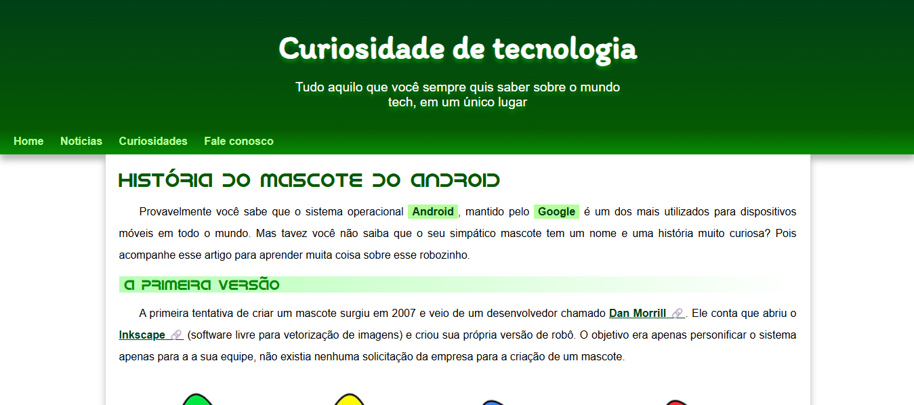

# Projeto Android

Este foi um dos primeiros sites que criei durante o curso de <strong>HTML5 e CSS3</strong> do <strong>CursoemVideo</strong> com o professor <strong>Gustavo Guanabara</strong>. O projeto conta um pouco da história do <strong>Android</strong> e foi uma ótima oportunidade para treinar minhas habilidades em <strong>HTML e CSS</strong>. Nele, explorei recursos como iframe, marcações de texto, inserção de links, imagens e emojis, além da criação de tabelas e da implementação de responsividade. Foi uma experiência muito rica, especialmente para fortalecer meus conhecimentos em <strong>CSS</strong> e consolidar conceitos fundamentais de <strong>desenvolvimento web</strong>.

## Demonstração

## Link do projeto

Este é o link do projeto <a href= "https://anajulialeite.github.io/projeto-android/">Android</a>

## License

